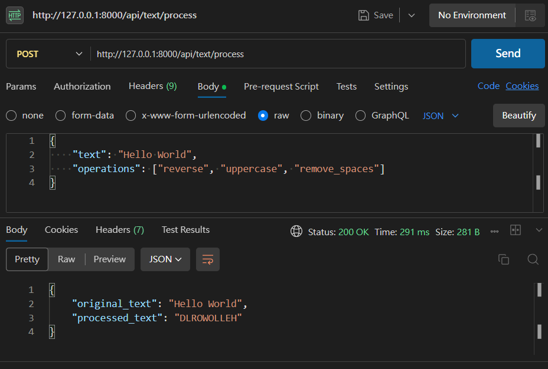
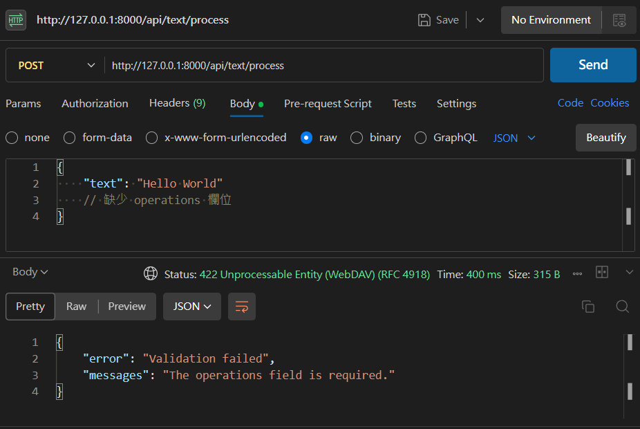
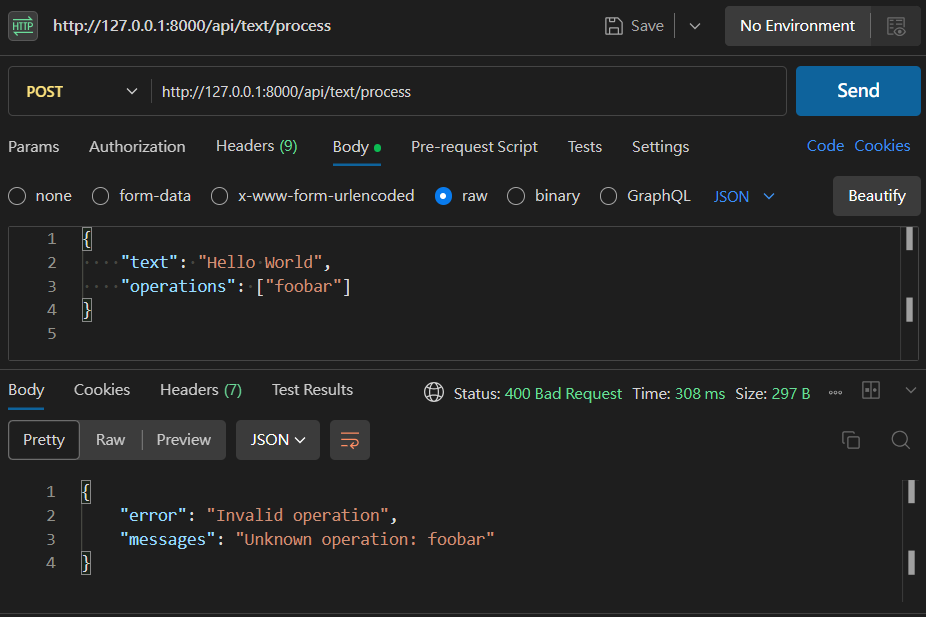

# Laravel Text Processor API

##  專案介紹
這是一個使用 Laravel 開發的 RESTful API，提供基本的文字處理功能，主要用於簡單的字串操作，例如反轉文字、轉換大小寫、去除空白等。

---

##  功能清單
-  反轉文字 (reverse)
-  轉換成大寫 (uppercase)
-  轉換成小寫 (lowercase)
-  移除空白 (remove_spaces)

---

##  API 說明文件

### ➤ POST `/api/text/process`
####  說明
根據 `operations` 操作參數處理輸入文字。

---

#### 🔸 Request Headers
```
Content-Type: application/json
```

#### 🔸 Request Body 範例
```json
{
    "text": "Hello World",
    "operations": ["reverse", "uppercase"]
}
```

---

#### 🔸 支援操作指令
| 操作名稱        | 說明       |
|----------------|------------|
| reverse        | 反轉文字   |
| uppercase      | 全部大寫   |
| lowercase      | 全部小寫   |
| remove_spaces  | 移除空白   |

---

#### 🔸 Response 成功範例（200 OK）

```json
{
    "original_text": "Hello World",
    "processed_text": "DLROW OLLEH"
}
```

---

##  錯誤處理

### ➤ 1. 驗證失敗（422 Unprocessable Entity）

```json
{
    "error": "Validation failed",
    "messages": "The operations field is required."
}
```
- 當 `text` 或 `operations` 缺失、格式錯誤，會出現此錯誤。

### ➤ 2. 無效操作（400 Bad Request）

```json
{
    "error": "Invalid operation",
    "messages": "Unknown operation: foobar"
}
```
- 若 `operations` 中有不支援的操作指令，將回傳此錯誤
### ➤ 3. 系統錯誤（500 Internal Server Error）
```json
{
    "error": "Server Error",
    "messages": "Something went wrong"
}
```
- 伺服器發生不可預期錯誤
- 可查看 logs 了解錯誤原因
---

##  專案架構
```
app/
 ├── Http/Controllers/TextController.php
 └── Services/TextService.php

routes/
 └── api.php
```
---
##  邊界條件處理

| 邊界狀況           | 解決方法 |
|--------------------|--------------------|
| **text 太長**       | 驗證規則加 `max:10000`限制最大長度 10,000 字元，超過時驗證失敗 |
| **operations 重複指令** | 使用`array_unique`去掉重複 |
| **無效操作指令**     | 回傳 400 錯誤，並列出未知操作名稱 |
| **特殊字元 / emoji** | 修改reverse方法 |
| **操作順序影響**     | 操作會依照傳入 `operations` 的順序依序處理 |


---
##  應對未來操作增多的擴展性設計
  
將每個操作獨立封裝，保持系統高內聚、低耦合，方便後續擴展與維護。


### 未來擴展架構

```
app/
├── Http/
│   └── Controllers/
│       └── TextProcessController.php       # 控制器，處理請求
├── Services/
│   └── TextProcessorService.php            # 業務邏輯，分發操作策略
├── Strategies/                             # 各操作策略類別
│   ├── ReverseTextStrategy.php             # 反轉文字
│   ├── UppercaseTextStrategy.php           # 轉大寫
│   ├── LowercaseTextStrategy.php           # 轉小寫
│   └── RemoveSpacesTextStrategy.php        # 移除空白
```


####  架構優點
- 策略類別獨立 ➜ 新增操作只需擴充 `Strategies` 資料夾     
- 減少複雜邏輯 ➜ Controller 與 Service 更單一職責  
- 每個策略皆可獨立單元測試 ➜ 易於維護與測試  

##  作者資訊
- Author: 呂文揚
- GitHub: [https://github.com/mark20306]

