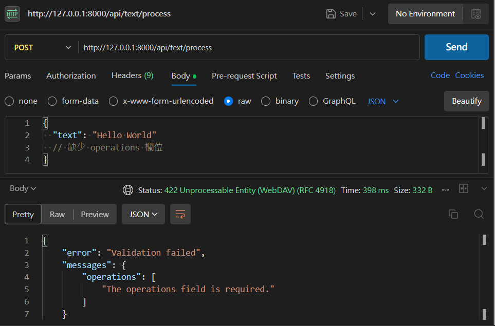
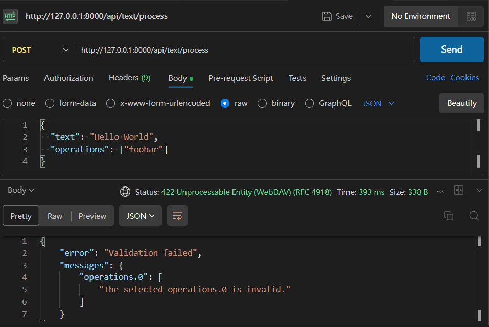
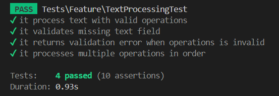
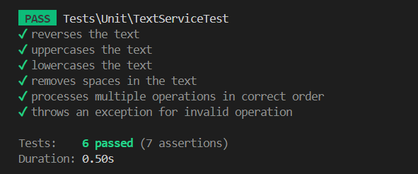

# Laravel Text Processor API

##  專案介紹
這是一個使用 Laravel 開發的 RESTful API，提供基本的文字處理功能，主要用於簡單的字串操作，例如反轉文字、轉換大小寫、去除空白等。

---

##  功能清單
-  反轉文字 (reverse)
-  轉換成大寫 (uppercase)
-  轉換成小寫 (lowercase)
-  移除空白 (remove_spaces)

---

##  API 說明文件

### ➤ POST `/api/text/process`
####  說明
根據 `operations` 操作參數處理輸入文字。

---

#### 🔸 Request Headers
```
Content-Type: application/json
```

#### 🔸 Request Body 範例
```json
{
    "text": "Hello World",
    "operations": ["reverse", "uppercase"]
}
```

---

#### 🔸 支援操作指令
| 操作名稱        | 說明       |
|----------------|------------|
| reverse        | 反轉文字   |
| uppercase      | 全部大寫   |
| lowercase      | 全部小寫   |
| remove_spaces  | 移除空白   |

---

#### 🔸 Response 成功範例（200 OK）

```json
{
    "original_text": "Hello World",
    "processed_text": "DLROWOLLEH"
}
```

---

##  錯誤處理


### ➤ 1. 驗證失敗（422 Unprocessable Entity）
當 `text` 或 `operations` 欄位缺失、格式錯誤，或 `operations` 包含無效操作時，會回傳此錯誤。


`operations`  欄位缺失：  

```json
{
    "error": "Validation failed",
    "messages": {
        "operations": [
            "The operations field is required."
        ]
    }
}
```

`operations` 包含無效操作：  


```json
{
    "error": "Validation failed",
    "messages": {
        "operations.0": [
            "The selected operations.0 is invalid."
        ]
    }
}
```

 驗證規則說明：  
- `text` 欄位必填，必須為字串  
- `operations` 必須是陣列  
- `operations.*` 必須是 `reverse`、`uppercase`、`lowercase`、`remove_spaces` 其中之一  
- 任一條件未符合 ➜ 422 錯誤

---

### ➤ 2. 系統錯誤（500 Internal Server Error）
伺服器發生不可預期錯誤時，回傳 500 錯誤。


```json
{
    "error": "Server Error",
    "messages": "Something went wrong"
}
```

 通常原因  
- 非預期例外（Exception）  
- 可以查看 `storage/logs/laravel.log` 取得詳細錯誤資訊  


##  專案架構
```
app/
 ├── Http/Controllers/TextController.php
 └── Services/TextService.php

routes/
 └── api.php
```
---
##  邊界條件處理

| 邊界狀況           | 解決方法 |
|--------------------|--------------------|
| **text 太長**       | 驗證規則加 `max:10000`限制最大長度 10,000 字元，超過時驗證失敗 |
| **operations 重複指令** | 使用`array_unique`去掉重複 |
| **無效操作指令**     | 回傳 422 錯誤 |
| **特殊字元 / emoji** | 修改reverse方法 |
| **操作順序影響**     | 操作會依照傳入 `operations` 的順序依序處理 |
---
##  測試說明

專案包含 **Feature Test** 與 **Unit Test**，確保 API 與業務邏輯的正確性與穩定性。


###  Feature Test（功能測試）

### 測試目標
驗證 RESTful API `/api/text/process` 是否依據傳入 `operations` 正確處理文字。

### 測試報告截圖

###  Unit Test（單元測試）

### 測試目標
測試 `TextService` 業務邏輯，確保每個操作功能正常。

### 測試報告截圖


---
##  應對未來操作增多的擴展性設計
  
將每個操作獨立封裝，保持系統高內聚、低耦合，方便後續擴展與維護。


### 未來擴展架構

```
app/
├── Http/
│   └── Controllers/
│       └── TextProcessController.php       # 控制器，處理請求
├── Services/
│   └── TextProcessorService.php            # 業務邏輯，分發操作策略
├── Strategies/                             # 各操作策略類別
│   ├── ReverseTextStrategy.php             # 反轉文字
│   ├── UppercaseTextStrategy.php           # 轉大寫
│   ├── LowercaseTextStrategy.php           # 轉小寫
│   └── RemoveSpacesTextStrategy.php        # 移除空白
```


####  架構優點
- 策略類別獨立 ➜ 新增操作只需擴充 `Strategies` 資料夾     
- 減少複雜邏輯 ➜ Controller 與 Service 更單一職責  
- 每個策略皆可獨立單元測試 ➜ 易於維護與測試  

##  作者資訊
- Author: 呂文揚
- GitHub: [https://github.com/mark20306]

